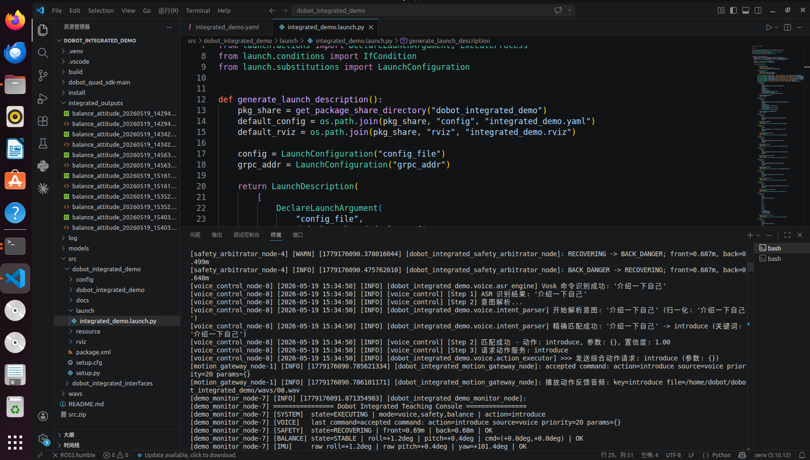

# Dobot Integrated Demo 综合演示工程

`dobot_integrated_demo` 是面向 Dobot 四足机器人的综合演示工程，整合了语音控制、前后深度避障、IMU 姿态平衡补偿、RViz 可视化、姿态数据记录和本地 WAV 动作反馈音频播报等能力。通过统一动作网关、统一系统状态和统一 launch 启动方式，将多个模块协调到一套可运行、可调试的 ROS 2 工程中。

## 1. 核心功能概览

当前工程支持以下功能：

- 语音控制：支持“向前走、向后退、向左移动、向右移动、向左转、向右转、挥手、介绍一下自己”等演示指令。
- 离线语音识别：默认使用 Vosk 离线 ASR，降低对网络环境的依赖；保留百度 ASR 配置作为可选备用方案。
- 统一动作网关：所有语音动作、平衡补偿动作、安全动作统一进入 `/integrated/robot_command`，避免多个模块同时直接控制机器人。
- 前后避障：读取前后深度相机数据，发布前后障碍物距离、安全状态、RViz Marker、深度图和点云。
- 安全仲裁：根据前后障碍物状态限制危险方向动作，避免误触发趴下或多模块控制冲突。
- IMU 平衡补偿：读取底层 IMU 姿态，计算 roll/pitch 偏差，并在达到阈值后触发姿态补偿动作。
- 监控面板：在控制台集中显示系统状态、语音动作、安全状态、IMU 状态、平衡补偿状态和深度流状态。
- 姿态数据记录：退出 launch 后自动生成 CSV 数据和 HTML 曲线，便于调试分析和展示。
- 本地音频播报：执行动作时播放 `wavs/01.wav` 到 `wavs/08.wav` 对应的本地反馈音频。
- RViz 可视化：展示前后深度图、点云、障碍物距离 Marker 和 TF 坐标关系。

## 2. 系统架构

综合工程的核心设计是“一个动作入口、多个功能模块、统一状态输出”。

```text
语音采集/ASR
    -> 意图解析
    -> /integrated/robot_command
    -> motion_gateway_node
    -> RobotClient
    -> 机器人动作执行

深度相机 DDS
    -> depth_bridge_node
    -> /safety_guard/front/distance
    -> /safety_guard/back/distance
    -> safety_arbitrator_node
    -> /integrated/safety_state
    -> motion_gateway_node 安全拦截

IMU DDS
    -> imu_reader_node
    -> /balance_control/imu_rpy
    -> balance_compensator_node
    -> /integrated/robot_command
    -> motion_gateway_node
    -> 姿态补偿动作

本地 WAV
    -> AudioPlayer
    -> VoiceCmd(header/priority/task_id/type/path/data/flag)
    -> DDS rt/voice/cmd 新版语音播报链路
    -> 机器人扬声器
```

主要节点说明：

| 节点                            | 作用                                                         |
| ------------------------------- | ------------------------------------------------------------ |
| `motion_gateway_node`           | 综合动作网关，唯一持有 `RobotClient`，负责动作执行、安全拦截、反馈音频播放。 |
| `integrated_state_manager_node` | 综合状态管理，汇总语音、安全、平衡和动作事件。               |
| `voice_control_node`            | 语音采集、ASR、意图解析、动作服务调用。                      |
| `depth_bridge_node`             | 接入前后深度 DDS 数据，发布距离、深度图、点云和 Marker。     |
| `safety_arbitrator_node`        | 根据前后距离判断 `SAFE / FRONT_DANGER / BACK_DANGER / BOTH_DANGER / SENSOR_STALE`。 |
| `imu_reader_node`               | 从底层 DDS 读取 IMU 姿态并发布 roll/pitch/yaw。              |
| `balance_compensator_node`      | 姿态滤波、误差计算和补偿动作触发。                           |
| `demo_monitor_node`             | 综合控制台面板。                                             |
| `attitude_plot_recorder_node`   | 记录姿态数据，退出时生成 CSV 和 HTML 曲线。                  |

## 2. 工程目录

```text
dobot_integrated_demo/
├── README.md
├── assets/                           # README 图片资源
├── dobot_quad_sdk-main/              # Dobot SDK 与 DDS 依赖包
├── integrated_outputs/               # 姿态平衡数据、可视化补偿曲线
├── wavs/                             # 动作反馈本地 WAV 音频
├── models/                           # Vosk 离线 ASR 模型，需按需安装
└── src/
    ├── dobot_integrated_interfaces/  # 自定义消息和服务
    └── dobot_integrated_demo/        # 综合功能包
        ├── config/integrated_demo.yaml
        ├── launch/integrated_demo.launch.py
        ├── rviz/integrated_demo.rviz
        └── dobot_integrated_demo/
            ├── core/                 # 动作网关、安全仲裁、综合状态机
            ├── voice/                # 语音采集、ASR、意图解析、反馈播报
            ├── perception/           # 深度图桥接、距离、点云、Marker
            └── balance/              # IMU 读取、姿态补偿、曲线记录
```

## 3. 环境要求

- Ubuntu 22.04
- ROS 2 Humble
- Python 3.10
- 开发机和机器狗处于 `192.168.5.x` 有线网段
- 机器狗地址默认 `192.168.5.2:50051`
- Dobot 高层 SDK 已安装
- DDS 中间件和 Python 绑定版本与机器狗固件匹配
- 可选：Vosk 中文离线模型 `vosk-model-small-cn-0.22`

> 注意：工程目录建议放在机器人调试主机的 `~/dobot_integrated_demo`。下文命令均以该路径为例。

## 4. 安装依赖

安装系统依赖：

```bash
sudo apt update
sudo apt install -y python3-venv python3-pip python3-colcon-common-extensions
```

创建并激活虚拟环境：

```bash
cd ~/dobot_integrated_demo
python3 -m venv .venv
source .venv/bin/activate
python -m pip install --upgrade pip setuptools wheel
python -m pip install empy==3.3.4 catkin_pkg lark requests pyyaml numpy opencv-python vosk
```

安装 Dobot 高层 gRPC SDK：

```bash
cd ~/dobot_integrated_demo/dobot_quad_sdk-main/high_level/python
python -m pip install -e .
```

验证高层 SDK，若有输出则代表安装成功：

```bash
python -c "import dobot_quad; print(dobot_quad.__file__)"
```

安装 DDS 中间件和 Python 依赖：

```bash
cd ~/dobot_integrated_demo/dobot_quad_sdk-main/dist
sudo dpkg -i dds-middleware-with-thirdparty_0.23.*_amd64.deb
export CYCLONEDDS_HOME="/usr/local/"
python -m pip install --force-reinstall dds_middleware_python-0.23.*-cp310-cp310-linux_x86_64.whl
python -m pip install cyclonedds
```

验证 DDS 依赖：

```bash
python -c "import dds_middleware_python; print('dds ok')"
python -c "import cyclonedds; print('cyclonedds ok')"
```

## 5. Vosk 离线模型配置安装

本demo使用 Vosk 离线中文模型，基于当前机器狗语音功能边界， Vosk 离线中文模型相比云端百度语音模型会稳定些

默认配置使用 Vosk 离线 ASR：

```yaml
asr:
  provider: "vosk"
  vosk:
    model_path: "models/vosk-model-small-cn-0.22"
```

**注：离线模型语音识别准确率依然受环境噪声影响，指令误识别是正常现象，建议多尝试几次**

```bash
cd ~/dobot_integrated_demo
source .venv/bin/activate
mkdir -p models
cd models
wget https://alphacephei.com/vosk/models/vosk-model-small-cn-0.22.zip   #当前工程包已经包含，可省略
unzip vosk-model-small-cn-0.22.zip
```

模型目录应为：

```text
~/dobot_integrated_demo/models/vosk-model-small-cn-0.22
```

如果需要临时改回百度 ASR，可在 `src/dobot_integrated_demo/config/integrated_demo.yaml` 中修改：

```yaml
asr:
  provider: "baidu"
```

## 6. 网络和 DDS 配置

确认连接机器狗的有线网卡名称：

```bash
ip a
```

如需手动设置开发机 IP：

```bash
sudo ip addr add 192.168.5.100/24 dev <网卡名>    ###设置网卡ip
sudo ip link set <网卡名> up   ###连接
```

启动前设置 CycloneDDS：

```bash
export CYCLONEDDS_URI=file:///home/$USER/dobot_integrated_demo/dobot_quad_sdk-main/cyclonedds.xml
```

如果使用虚拟机桥接网卡，确认 `cyclonedds.xml` 中网卡名为连接机器狗的有线网卡，例如：

```xml
###修改为实际的网卡名
<NetworkInterface name="网卡名" priority="default" multicast="true" />
```

## 7. 编译工程

必须从工作区根目录编译和运行：

```bash
cd ~/dobot_integrated_demo
source .venv/bin/activate
source /opt/ros/humble/setup.bash
colcon build --base-paths src --packages-select dobot_integrated_interfaces dobot_integrated_demo
source install/setup.bash
```

如果修改程序代码或者遇到旧文件缓存或安装目录异常，可清理后重新编译：

```bash
cd ~/dobot_integrated_demo
rm -rf build install log
colcon build --base-paths src --packages-select dobot_integrated_interfaces dobot_integrated_demo
source install/setup.bash
```

## 8. 启动方式

完整综合演示：

```bash
cd ~/dobot_integrated_demo
source .venv/bin/activate
source install/setup.bash
export CYCLONEDDS_URI=file:///home/$USER/dobot_integrated_demo/dobot_quad_sdk-main/cyclonedds.xml
ros2 launch dobot_integrated_demo integrated_demo.launch.py
```

默认主终端会显示综合面板，汇总语音、动作、安全和 IMU 平衡摘要。深度距离和 IMU 高频数据不作为主终端连续日志展示；需要细节时可查看CSV 或 HTML 曲线，保存在**integrated_outputs**文件夹中。

## 9. 核心配置说明

主要配置文件：

```text
src/dobot_integrated_demo/config/integrated_demo.yaml
```

机器人配置：

```yaml
robot:
  grpc_addr: "192.168.5.2:50051"
  enable_execute: true
  enable_builtin_obstacle_avoidance: true
  dds_config: "dobot_quad_sdk-main/low_level/python/config/dds_config.yaml"
  dds_domain_id: 0
```

反馈音频配置：

```yaml
feedback_audio:
  enabled: true
  backend: "direct"
  use_dds_config: true
  voice_cmd_topic: "rt/voice/cmd"
  base_dir: "wavs"
```

避障距离配置：

```yaml
safety:
  front_danger_distance_m: 0.50
  front_recover_distance_m: 0.70
  back_danger_distance_m: 0.50
  back_recover_distance_m: 0.70
```

平衡补偿配置：

```yaml
control:
  enable_balance_execute: true
  trigger_threshold_deg: 3.0
  settle_threshold_deg: 1.5
  max_compensation_deg: 10.0
  compensation_mode: "combined"
```

RViz 性能相关配置：

```yaml
visualization:
  publish_depth_image: true
  publish_point_cloud: true
  pointcloud:
    sample_step: 8
    max_points: 4000
    publish_period_seconds: 0.5
```

## 10. 常用 ROS 接口

服务：

| 名称                        | 类型                                           | 说明                 |
| --------------------------- | ---------------------------------------------- | -------------------- |
| `/integrated/robot_command` | `dobot_integrated_interfaces/srv/RobotCommand` | 综合动作服务。       |
| `/integrated/set_demo_mode` | `dobot_integrated_interfaces/srv/SetDemoMode`  | 设置综合 demo 模式。 |

常用话题：

| 名称                                  | 类型                             | 说明                 |
| ------------------------------------- | -------------------------------- | -------------------- |
| `/integrated/system_state`            | `SystemState`                    | 综合系统状态。       |
| `/integrated/system_state_text`       | `std_msgs/String`                | 文本形式系统状态。   |
| `/integrated/command_events`          | `std_msgs/String`                | 动作网关事件。       |
| `/integrated/safety_state`            | `SafetyState`                    | 综合安全状态。       |
| `/integrated/balance_status`          | `BalanceStatus`                  | 平衡补偿状态。       |
| `/safety_guard/front/distance`        | `std_msgs/Float32`               | 前方障碍物距离。     |
| `/safety_guard/back/distance`         | `std_msgs/Float32`               | 后方障碍物距离。     |
| `/safety_guard/front/depth/image_raw` | `sensor_msgs/Image`              | 前深度图。           |
| `/safety_guard/back/depth/image_raw`  | `sensor_msgs/Image`              | 后深度图。           |
| `/safety_guard/points`                | `sensor_msgs/PointCloud2`        | ROI 点云。           |
| `/safety_guard/markers`               | `visualization_msgs/MarkerArray` | RViz 安全 Marker。   |
| `/balance_control/imu_rpy`            | `std_msgs/Float32MultiArray`     | IMU roll/pitch/yaw。 |
| `/balance_control/attitude`           | `std_msgs/Float32MultiArray`     | 姿态滤波与补偿指令。 |
| `/balance_control/attitude_report`    | `std_msgs/String`                | 姿态文本报告。       |

## 11. 状态说明

默认启动后，主终端会周期显示综合面板：



```text
================ Dobot Integrated Teaching Console ================
[SYSTEM]  state=EXECUTING | mode=voice,safety,balance | action=introduce
[VOICE]   last_command=accepted command: action=introduce source=voice priority=20 params={}
[SAFETY]  state=RECOVERING | front=0.69m | back=0.66m | OK
[BALANCE] state=STABLE | roll=+2.9deg | pitch=+0.4deg | cmd=(-2.3deg,+0.0deg) | OK
[IMU]     raw_roll=+2.9deg | raw_pitch=+0.4deg | yaw=+101.3deg | OK
[EVENT]   balance_triggers=000 | accepted command: action=introduce source=voice priority=20 params={}
[DEPTH]   depth_bridge stats: rx(front/back)=430/438, drop(front/back)=0/0, ...
===================================================================
```

字段含义：

- `[SYSTEM]`：综合状态机。`state` 表示当前整体状态，`mode` 表示启用的模块，`action` 表示当前动作。
- `[VOICE]`：最近动作事件。语音识别成功后通常会看到 `source=voice` 和对应 `action`。
- `[SAFETY]`：避障状态。`front`/`back` 是前后 ROI 最近障碍距离，`OK` 表示安全 topic 正常更新。
- `[BALANCE]`：滤波后的平衡状态。`roll`/`pitch` 是滤波姿态角，`cmd` 是控制器计算出的补偿角。
- `[IMU]`：IMU 原始姿态。用于判断机器狗当前横滚、俯仰和航向数据是否正常。
- `[EVENT]`：最近关键事件。`balance_triggers` 是本次启动后触发姿态补偿的次数。
- `[DEPTH]`：深度桥接统计。`rx` 是收到的前后深度帧数，`drop` 是丢弃帧数，主要用于确认深度流是否正常。

常见状态：

- `LISTENING`：等待语音指令。
- `EXECUTING`：正在执行动作。
- `AVOIDING`：避障状态或安全模块阻止移动。
- `BALANCE_COMPENSATING`：正在执行姿态补偿。
- `SAFE`：前后距离均恢复到安全范围。
- `RECOVERING`：不在危险区，但还没有完全超过恢复阈值。
- `FRONT_DANGER` / `BACK_DANGER` / `BOTH_DANGER`：前方、后方或前后均危险。
- `SENSOR_STALE`：深度数据超时。
- `STABLE`：IMU 平衡模块正常，当前没有执行补偿。
- `COMPENSATING`：IMU 平衡模块正在触发补偿。

说明：`cmd` 出现非零不代表一定执行补偿，只有姿态误差超过 `control.trigger_threshold_deg` 且满足冷却时间时，才会通过动作网关请求 `balance_compensate`。
